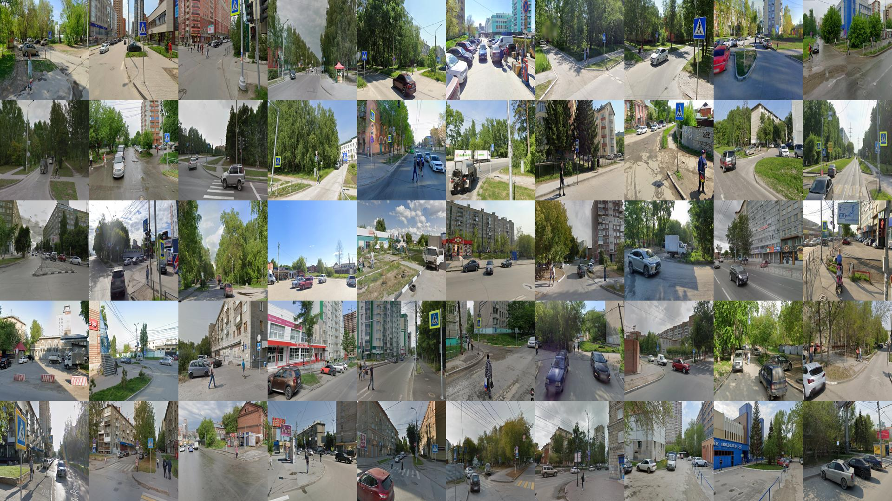
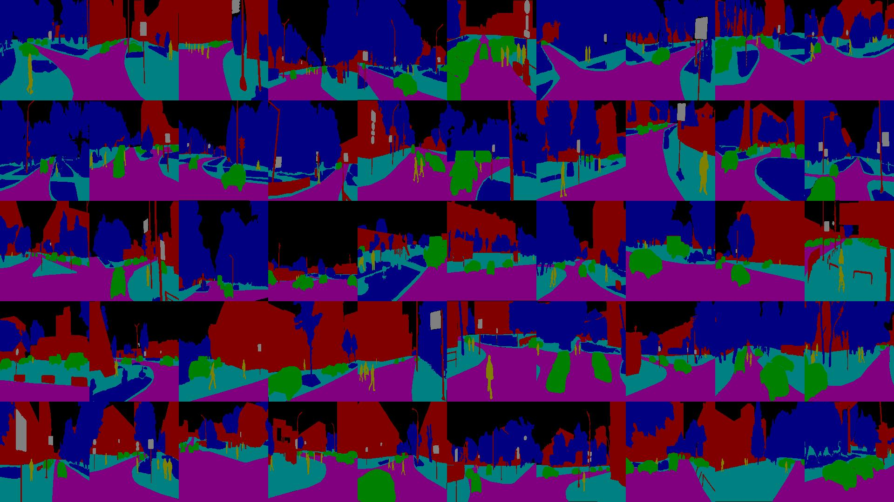
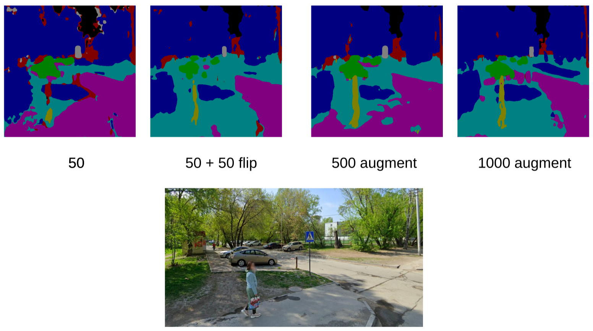
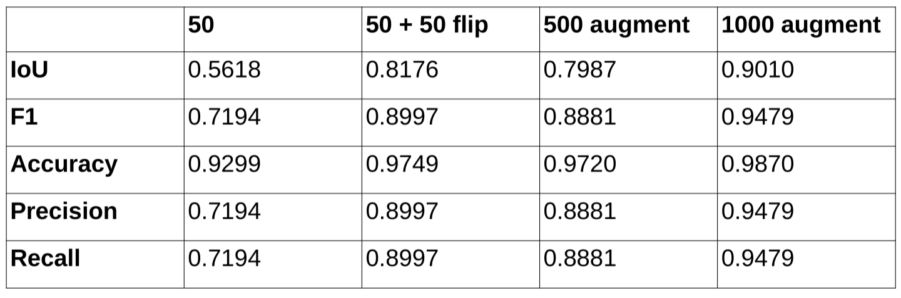

# Семантическая сегментация Unet + ResNet50
## Описание

Проект обучения модели Unet c ResNet50 в качестве энкодера.

Основано на материале статьи https://arxiv.org/abs/2507.20389

Обучение на небольшом датасете из 50 снимков с google streetview, с применением аугментации до 1000 шт.

### Результаты
Степень распознавания при 50 изображениях и разном размере аугментации:

Полученные результаты метрик на тестовой выборке:

Демонстрация распознавания (1000):

## Установка и запуск
` pip install -r requirements.txt`

`cd fastapi`

` uvicorn app:app --reload`

Изображения вычитываются из папки `fastapi/image`, распознанные маски выкладываются в папку `fastapi/mask`.

Пример запуска распознования:

`curl -i -X POST http://localhost:8000/process_images/`
